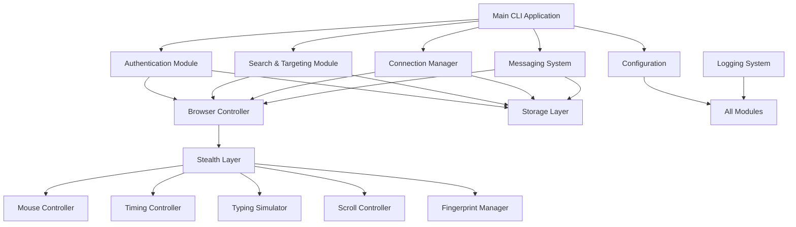
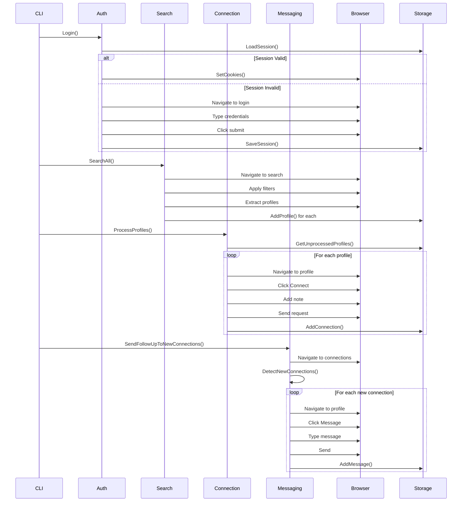

# LinkedIn Automation - Architecture Documentation

## System Overview

This LinkedIn automation tool is built with a modular, layered architecture designed for maintainability, testability, and sophisticated anti-detection capabilities.



## Package Structure

### Core Packages

#### `pkg/browser`
**Responsibility**: Browser automation wrapper around Rod framework

**Key Components**:
- `Browser` struct: Main browser controller
- Visible cursor injection for demos
- Element interaction with stealth integration
- Screenshot and cookie management

**Anti-Detection Integration**:
- Injects custom mouse movement via `MouseController`
- Uses `TimingController` for realistic delays
- Applies `FingerprintManager` for browser masking

#### `pkg/auth`
**Responsibility**: LinkedIn authentication and session management

**Key Components**:
- `Authenticator` struct: Handles login flow
- Session persistence and restoration
- Security checkpoint detection (2FA, CAPTCHA)
- Login error detection

**Flow**:
1. Check for existing valid session
2. Restore session cookies if valid
3. Otherwise, perform fresh login
4. Save session for future use

#### `pkg/search`
**Responsibility**: Profile search and targeting

**Key Components**:
- `Searcher` struct: Search orchestration
- `VisualSearcher` struct: UI-based search with filters
- Duplicate profile detection
- Profile URL normalization
- Pagination handling

**Duplicate Detection Strategy**:
- In-memory deduplication using map
- Storage-based deduplication via `ProfileExists()`
- URL normalization before comparison

#### `pkg/connection`
**Responsibility**: Connection request management

**Key Components**:
- `ConnectionManager` struct: Handles connection flow
- Rate limiting (daily/hourly quotas)
- Personalized note generation
- Connection tracking

**Rate Limiting**:
- Checks daily and hourly limits before sending
- Resets counters at midnight
- Enforces cooldown periods

#### `pkg/messaging`
**Responsibility**: Message composition and delivery

**Key Components**:
- `Messenger` struct: Message orchestration
- Template-based messaging
- New connection detection
- Follow-up automation

**Template System**:
- Supports variable substitution ({{.FirstName}}, {{.Company}})
- Multiple template types (connection, message)
- Character limit enforcement

### Stealth Layer

#### `pkg/stealth/mouse.go`
**Anti-Detection Technique**: Human-like mouse movement

**Implementation**:
- Bézier curve generation with configurable complexity
- Variable speed profiles
- Natural overshoot and micro-corrections
- Visible red cursor overlay for demos

**Algorithm**:
```
1. Generate control points for Bézier curve
2. Add random overshoot beyond target
3. Sample curve at variable intervals
4. Apply speed variation (slow start, fast middle, slow end)
5. Add micro-movements near target
```

#### `pkg/stealth/timing.go`
**Anti-Detection Technique**: Randomized timing patterns

**Implementation**:
- Action delays: 500ms - 2000ms (configurable)
- Think time: 1000ms - 5000ms (configurable)
- Human variation: ±30% randomization
- Page load waits

**Randomization Strategy**:
- Uses `math/rand` with time-based seed
- Applies Gaussian distribution for natural variation
- Different delay types for different actions

#### `pkg/stealth/typing.go`
**Anti-Detection Technique**: Realistic typing simulation

**Implementation**:
- Variable key delays: 50ms - 150ms
- Typo injection: 2% chance (configurable)
- Automatic typo correction with backspace
- Think pauses between words

**Typo Simulation**:
```
1. For each character, roll typo chance
2. If typo, insert adjacent key character
3. Add correction delay
4. Send backspace event
5. Send correct character
```

#### `pkg/stealth/scrolling.go`
**Anti-Detection Technique**: Natural scrolling behavior

**Implementation**:
- Variable scroll speeds: 50-200 pixels/step
- Smooth acceleration/deceleration
- Random scroll-back: 10% chance
- Pause during scrolling: 15% chance

**Scroll Steps**:
- Breaks large scrolls into smaller steps
- Varies step size and timing
- Occasionally scrolls back up (human-like)

#### `pkg/stealth/fingerprint.go`
**Anti-Detection Technique**: Browser fingerprint masking

**Implementation**:
- User agent rotation
- Viewport randomization
- WebDriver flag removal
- Timezone spoofing
- Language spoofing

**Fingerprint Modifications**:
```javascript
// Injected into page
Object.defineProperty(navigator, 'webdriver', {
  get: () => undefined
});

// Timezone override
Intl.DateTimeFormat = ...

// Canvas fingerprint randomization
CanvasRenderingContext2D.prototype.getImageData = ...
```

#### `pkg/stealth/scheduler.go`
**Anti-Detection Technique**: Activity scheduling

**Implementation**:
- Business hours enforcement (9 AM - 6 PM)
- Weekday-only operation
- Random break intervals
- Cooldown periods

### Supporting Packages

#### `pkg/storage`
**Responsibility**: Data persistence

**Storage Files**:
- `connections.json`: Connection request tracking
- `messages.json`: Message history
- `profiles.json`: Discovered profiles
- `session.json`: Authentication session
- `stats.json`: Daily statistics

**Data Structures**:
- Thread-safe with `sync.RWMutex`
- JSON serialization
- Atomic file writes

#### `pkg/config`
**Responsibility**: Configuration management

**Configuration Sources**:
1. YAML file (`config.yaml`)
2. Environment variables (override)
3. Default values (fallback)

**Validation**:
- Required field checking
- Range validation
- Type safety

#### `pkg/logger`
**Responsibility**: Structured logging

**Features**:
- Component-based logging
- Log levels: DEBUG, INFO, WARN, ERROR
- File and console output
- JSON and text formats
- Log rotation

## Data Flow

### Full Automation Cycle



## Anti-Detection Strategy

### Layered Defense

1. **Browser Fingerprint Layer**
   - Masks automation signals
   - Randomizes browser properties
   - Spoofs timezone/language

2. **Interaction Layer**
   - Human-like mouse movements
   - Realistic typing patterns
   - Natural scrolling behavior

3. **Timing Layer**
   - Randomized delays
   - Think time simulation
   - Activity scheduling

4. **Behavioral Layer**
   - Rate limiting
   - Break intervals
   - Business hours operation

### Detection Evasion Techniques

| Technique | Implementation | Effectiveness |
|-----------|---------------|---------------|
| Bézier Curves | `mouse.go` | High - Mimics human hand movement |
| Timing Randomization | `timing.go` | High - Prevents pattern detection |
| Typo Simulation | `typing.go` | Medium - Adds human imperfection |
| Fingerprint Masking | `fingerprint.go` | High - Hides automation flags |
| Activity Scheduling | `scheduler.go` | Medium - Mimics human work patterns |
| Rate Limiting | `connection.go`, `messaging.go` | High - Prevents spam detection |

## Code Quality Standards

### Error Handling

**Pattern**:
```go
result, err := someOperation()
if err != nil {
    log.Error("Operation failed: %v", err)
    return fmt.Errorf("failed to do X: %w", err)
}
```

**Principles**:
- Always wrap errors with context
- Log errors at appropriate level
- Graceful degradation where possible
- Retry with exponential backoff for transient failures

### Logging

**Pattern**:
```go
log := logger.WithComponent("module-name")
log.Info("Starting operation X")
log.Debug("Detail: %v", detail)
log.Warn("Warning: %v", warning)
log.Error("Error: %v", err)
```

**Principles**:
- Use component-based loggers
- Log at appropriate levels
- Include context in messages
- Avoid logging sensitive data

### Configuration

**Pattern**:
```go
type ModuleConfig struct {
    Enabled bool          `yaml:"enabled"`
    Timeout time.Duration `yaml:"timeout"`
}

func (c *ModuleConfig) Validate() error {
    if c.Timeout < 0 {
        return fmt.Errorf("timeout must be positive")
    }
    return nil
}
```

**Principles**:
- Use struct tags for YAML mapping
- Provide validation methods
- Set sensible defaults
- Document all fields

### Testing

**Pattern**:
```go
func TestFeature(t *testing.T) {
    t.Run("Success case", func(t *testing.T) {
        // Arrange
        input := setupInput()
        
        // Act
        result, err := doOperation(input)
        
        // Assert
        if err != nil {
            t.Fatalf("Unexpected error: %v", err)
        }
        if result != expected {
            t.Errorf("Expected %v, got %v", expected, result)
        }
    })
}
```

**Principles**:
- Use table-driven tests
- Test edge cases
- Use subtests for organization
- Mock external dependencies

## Performance Considerations

### Browser Automation
- Reuse browser instance across operations
- Minimize page loads
- Use element waiting with timeouts
- Cache selectors where possible

### Storage
- Batch writes when possible
- Use read locks for concurrent reads
- Minimize file I/O
- Consider in-memory caching for hot data

### Memory
- Close browser resources properly
- Limit result set sizes
- Stream large data sets
- Use context cancellation

## Security Considerations

### Credentials
- Never log passwords
- Use environment variables
- Encrypt session data
- Clear sensitive data on exit

### Data Storage
- Restrict file permissions (0644 for data, 0755 for dirs)
- Don't commit sensitive files
- Use `.gitignore` for secrets
- Consider encryption at rest

### Network
- Use HTTPS only
- Validate SSL certificates
- Handle rate limiting gracefully
- Respect robots.txt (even if bypassing)

## Extension Points

### Adding New Search Filters
1. Update `SearchQuery` struct in `pkg/search/search.go`
2. Add filter to `buildSearchURL()` method
3. Update `VisualSearcher.ApplyFilters()` for UI interaction
4. Add configuration in `config.yaml`

### Adding New Message Templates
1. Add template to `config.yaml` under `messaging.templates`
2. Use variable substitution: `{{.VariableName}}`
3. Set template type: `connection` or `message`
4. Reference by name in code

### Adding New Stealth Techniques
1. Create new file in `pkg/stealth/`
2. Implement controller struct with config
3. Integrate into `Browser` struct
4. Add configuration section
5. Add tests

## Deployment

### Build
```bash
go build -o linkedin-automation ./cmd/linkedin-automation
```

### Run
```bash
./linkedin-automation -config=./config.yaml -mode=full
```

### Docker (Optional)
```dockerfile
FROM golang:1.21-alpine
WORKDIR /app
COPY . .
RUN go build -o linkedin-automation ./cmd/linkedin-automation
CMD ["./linkedin-automation"]
```

## Troubleshooting

### Browser Not Launching
- Check Chrome/Chromium installation
- Verify user data directory permissions
- Check for port conflicts

### Login Failures
- Verify credentials in `.env`
- Check for security checkpoints (2FA)
- Clear session data and retry

### Rate Limiting
- Reduce daily/hourly limits in config
- Increase cooldown periods
- Add more random breaks

### Detection Issues
- Increase timing randomization
- Enable all stealth features
- Reduce operation speed
- Add more human-like pauses
